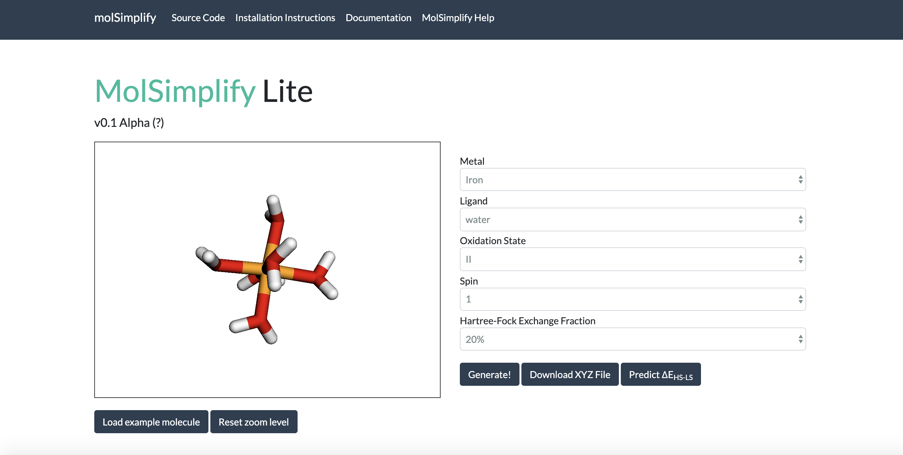

# MolSimplify Lite

### How to run molSimplify Lite (tested on Python 2.7.16):
- Install Flask, molSimplify, and any other necessary dependencies.
- Run `app.py` to start a server instance.
- Go to `http://localhost:8000/` in your browser (or whatever address `app.py` prints)
- Quit and re-run `app.py` every time you make changes to the frontend or backend.

### Structure of molSimplify Lite:
- Backend: `app.py`
- Frontend: `index.html`
  - Dependencies: Contained in `libraries/` folder (including Bootswatch theme).
  - HTML: Any lines inside the `<body>` tag.
  - JavaScript: Any lines inside the `<script>` tag.
  - CSS: Any lines inside the `<style>` tag.
  - Interactive elements: Look at the Javascript code inside the `<script>` tag at the bottom of the file.
